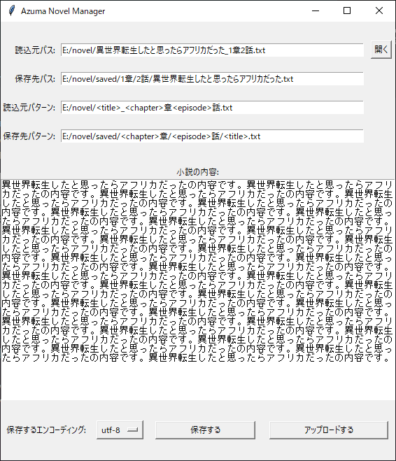

# Azuma Novel Manager

## 説明

小説を管理するためのツールです。
[あずまにゃん](https://github.com/Azuma-nyan/webtext)の作ったツールを模倣しています。

## 機能

- 小説（テキストファイル）を読み込んで、それを表示します。
- 読み込んだ小説のエンコーディングを指定して保存します。
- 読み込んだ小説を指定したパターンに従ってファイル名を指定して保存します。

## 動作方法

1. このリポジトリをクローンします。
2. pythonコマンドを使える環境を用意します。
3. `python __main__.py`を実行します。

## 使い方

### 読込元パス

読み込む小説のパスを指定します。
右の開くボタンを押すとファイル選択ダイアログが開きます。

### 保存先パス

保存する小説のパスを指定します。
読込元パターンと保存先パターンを指定することで、保存先のファイルパスを自動的に入力されます。

## 読込元パターン

読込元パスから抽出する文字列グループを指定します。
グループは`<group>`のような形で指定します。
既定値は`config.py`の`LOADED_NOVEL_PATTERN`で設定できます。

- 例1:
  - 読込元パス: `C:\Users\user\Documents\小説\吾輩は猫である.txt`
  - 読込元パターン: `C:\Users\user\Documents\小説\<小説名>.txt`
  - 抽出するキーと値:
    - `<小説名>`: `吾輩は猫である`
- 例2:
  - 読込元パス: `C:\Users\user\Documents\小説\異世界転生したと思ったらアフリカだった_1章2話.txt`
  - 読込元パターン: `C:\Users\user\Documents\小説\<title>_<chapter>章<episode>話.txt`
  - 抽出するキーと値:
    - `<title>`: `異世界転生したと思ったらアフリカだった`
    - `<chapter>`: `1`
    - `<episode>`: `2`

## 保存先パターン

読込元パターンから抽出した文字列グループを使って保存するファイルパスを指定します。
既定値は`config.py`の`SAVING_NOVEL_PATTERN`で設定できます。

- 例1:
  - 読込元パス: `C:\Users\user\Documents\小説\吾輩は猫である.txt`
  - 読込元パターン: `C:\Users\user\Documents\小説\<小説名>.txt`
  - 保存先パターン: `C:\Users\user\Documents\小説\<小説名>_utf8.txt`
  - 抽出するキーと値:
    - `<小説名>`: `吾輩は猫である`
  - 保存先パス: `C:\Users\user\Documents\小説\吾輩は猫である_utf8.txt`
- 例2:
  - 読込元パス: `C:\Users\user\Documents\小説\異世界転生したと思ったらアフリカだった_1章2話.txt`
  - 読込元パターン: `C:\Users\user\Documents\小説\<title>_<chapter>章<episode>話.txt`
  - 保存先パターン: `C:\Users\user\Documents\小説\<chapter>\<episode>\<title>.txt`
  - 抽出するキーと値:
    - `<title>`: `異世界転生したと思ったらアフリカだった`
    - `<chapter>`: `1`
    - `<episode>`: `2`
  - 保存先パス: `C:\Users\user\Documents\小説\1\2\異世界転生したと思ったらアフリカだった.txt`

## エンコーディング

読み込んだ小説のエンコーディングを指定します。
エンコーディングのリストは`config.py`の`ENCODINGS`で設定できます。
